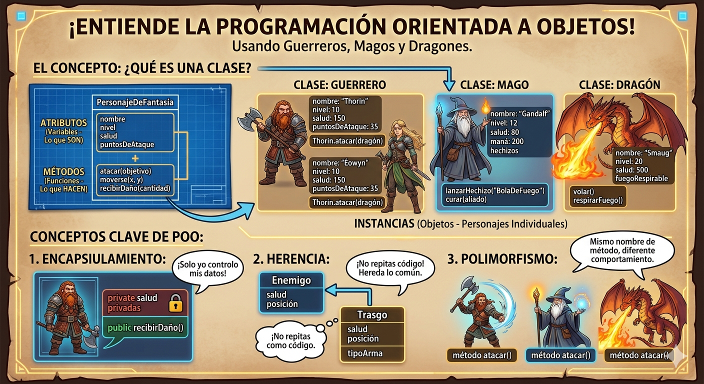
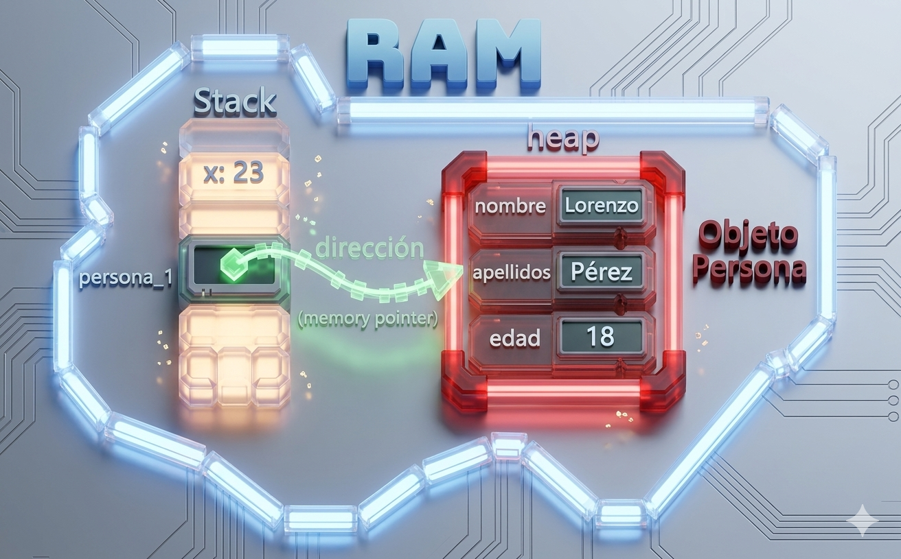

# POO en Python
Introducción a la Programación Orientada a Objetos (POO) en Python

## ¿Por qué aprender POO?

- Imagina que quieres crear un videojuego. Tienes guerreros, magos, dragones... cada uno con sus propios puntos de vida, ataques y habilidades. ¿Cómo los organizo en código sin repetir todo una y otra vez?

- La **Programación Orientada a Objetos (POO)** es la respuesta.  En lugar de escribir instrucciones sueltas, modelas el mundo real con *objetos* que tienen características y comportamientos.  Es la forma en que están construidos la mayoría de los programas profesionales del mundo.



## Clase y objeto

- Una clase es un tipo de dato cuyas variables se llaman objetos o instancias.

- La clase  es la definición del concepto del mundo real y los objetos o instancias son el propio "objeto" del mundo real.

- Las clases están compuestas por dos elementos:
    - **Atributos:** información que almacena la clase.
    - **Métodos:** operaciones que pueden realizarse con la clase.

## Definición de una clase en Python

``` Python
class NombreClase:

    def __init__(self, variable1, variable2):
        self.atributo1 = valor1
        self.atributo2 = valor2

    def nombreMetodo(self):
        BloqueCodigo
```

- `class` : palabra reservada en Python para definir una clase.
- `NombreClase` : nombre de la clase que se quiere crear.
- `def`: palabra reservada en Python que se utiliza para definir tanto el constructor de la clase (método que se ejecuta la primera vez que usas una clase) como los diferentes métodos que tiene.
- `__init__`: palabra reservada en Python para definir el método constructor de la clase.  El método `__init__` es lo primero que se ejecuta cuando creas una objeto de una clase.
- `(self, variableX)`: parámetro del constructor de la clase.  El paramétro `self` es obligatorio y después puedes tener tantos parámetros como quieras.  La forma de añadir paramétros es la misma que en las funciones.
- `self.AtributoX`: forma de utilización y acceso a los atributos de la clase.
- `nombreMetodo`: nombre del método de la clase.
- `self` : parámetro del método. El parámetro `self` es obligatorio y después puedes tener tantos parámetros como quieras. La forma de añadir paramétros es la misma que en las funciones.
- `BloqueCodigo` : instrucciones que ejecutará el método.

**Al definir una clase tenga en cuenta:**
- Puedes definir tantos atributos como necesites.
- Puedes definir tantos métodos como necesites.
- Puedes definit tantos parámetros en el constructor y en los métodos como necesites.

## Ejemplo 1

- Crear una clase que represente una persona.
- Atributos: nombre, apellidos y edad.
- Métodos: mostrar la información de la persona.

### Código

```Python
class Persona:

    # Método constructor de la clase
    def __init__(self, nombre, apellidos, edad):
        self.nombre = nombre
        self.apellidos = apellidos
        self.edad = edad

    # Método para mostrar la información de la persona
    def mostrarPersona(self):
        print("Nombre: ", self.nombre)
        print("Apellidos: ", self.apellidos)
        print("Edad: ", self.edad)
    
def main():
    print("Vamos a aprender POO...")
    persona_1 = Persona("Lorenzo", "Pérez", 18)
    persona_1.mostrarPersona()

if __name__ == main():
    main()
```

## Representación en RAM del objeto creado



