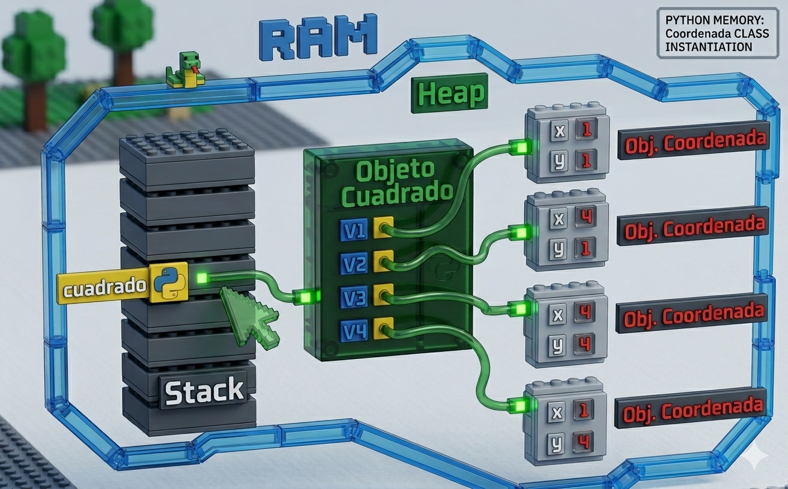

# POO en Python
Introducción a la Programación Orientada a Objetos (POO) en Python

## ¿Por qué aprender POO?

- Imagina que quieres crear un videojuego. Tienes guerreros, magos, dragones... cada uno con sus propios puntos de vida, ataques y habilidades. ¿Cómo los organizo en código sin repetir todo una y otra vez?

- La **Programación Orientada a Objetos (POO)** es la respuesta.  En lugar de escribir instrucciones sueltas, modelas el mundo real con *objetos* que tienen características y comportamientos.  Es la forma en que están construidos la mayoría de los programas profesionales del mundo.


## Clase y objeto

- Una clase es un tipo de dato cuyas variables se llaman objetos o instancias.

- La clase  es la definición del concepto del mundo real y los objetos o instancias son el propio "objeto" del mundo real.

- Las clases están compuestas por dos elementos:
    - **Atributos:** información que almacena la clase.
    - **Métodos:** operaciones que pueden realizarse con la clase.

## Definición de una clase en Python

``` Python
class NombreClase:

    def __init__(self, variable1, variable2):
        self.atributo1 = valor1
        self.atributo2 = valor2

    def nombreMetodo(self):
        BloqueCodigo
```

- `class` : palabra reservada en Python para definir una clase.
- `NombreClase` : nombre de la clase que se quiere crear.
- `def`: palabra reservada en Python que se utiliza para definir tanto el constructor de la clase (método que se ejecuta la primera vez que usas una clase) como los diferentes métodos que tiene.
- `__init__`: palabra reservada en Python para definir el método constructor de la clase.  El método `__init__` es lo primero que se ejecuta cuando creas una objeto de una clase.
- `(self, variableX)`: parámetro del constructor de la clase.  El paramétro `self` es obligatorio y después puedes tener tantos parámetros como quieras.  La forma de añadir paramétros es la misma que en las funciones.
- `self.AtributoX`: forma de utilización y acceso a los atributos de la clase.
- `nombreMetodo`: nombre del método de la clase.
- `self` : parámetro del método. El parámetro `self` es obligatorio y después puedes tener tantos parámetros como quieras. La forma de añadir paramétros es la misma que en las funciones.
- `BloqueCodigo` : instrucciones que ejecutará el método.

**Al definir una clase tenga en cuenta:**
- Puedes definir tantos atributos como necesites.
- Puedes definir tantos métodos como necesites.
- Puedes definit tantos parámetros en el constructor y en los métodos como necesites.

## Ejemplo 1

- Crear una clase que represente una persona.
- Atributos: nombre, apellidos y edad.
- Métodos: mostrar la información de la persona.

### Código

```Python
class Persona:

    # Método constructor de la clase
    def __init__(self, nombre, apellidos, edad):
        self.nombre = nombre
        self.apellidos = apellidos
        self.edad = edad

    # Método para mostrar la información de la persona
    def mostrarPersona(self):
        print("Nombre: ", self.nombre)
        print("Apellidos: ", self.apellidos)
        print("Edad: ", self.edad)
    
def main():
    print("Vamos a aprender POO...")
    persona_1 = Persona("Lorenzo", "Pérez", 18)
    persona_1.mostrarPersona()

if __name__ == main():
    main()
```

## Representación en RAM del objeto creado


## Composición

- Consiste en la creación de nuevas clases a partir de otras clases ya existentes que actúan como elementos compositores de la nueva.
- Las clases existentes serán atributos de la nueva clase.

### Ejemplo

- Una coordenada en dos dimensiones está compuesta por dos valores, el valor en el eje de las X y el valor en el eje de las Y.  Esto podría ser una clase
- Un cuadrado está compuesto por 4 coordenadas que son los cuatro vértices. Esto podría ser una clase que está compuesta por cuatro clases del objeto coordenada.

### Código Python
```Python
class Coordenada:
    # Metodo constructor
    def __init__(self, x, y):
        self.X = x
        self.Y = y

    def mostrarCoordenada(self):
        print("(",self.X,",",self.Y, ")")

class Cuadrado:
    # Método constructor
    def __init__(self, v1, v2, v3, v4):
        self.V1 = v1
        self.V2 = v2
        self.V3 = v3
        self.V4 = v4

    def mostrarVertices(self):
        print("El cuadrado está compuesto por los siguientes vértices:")
        self.V1.mostrarCoordenada()
        self.V2.mostrarCoordenada()
        self.V3.mostrarCoordenada()
        self.V4.mostrarCoordenada()
```
## Representación en RAM de la composicion



## Encapsulación

- Uno de los objetivos que tiene la POO es proteger los datos de acceso o usos no contralados, y ésto es lo que se conoce como **encapsulación**.
- Los datos (atributos) que componen una clase pueden ser de dos tipos:
    - **Públicos:** los datos son accesibles sin control, es decir, los datos pueden ser usados sin ningún tipo de mecanismo que protega ante usos no autorizados o indebidos.
    - **Privados:** los datos no pueden ser accedidos sin control y para acceder a ellos se deberá implementar un método que acceda a ellos.  De ésta manera, los datos únicamente serán accedidos directamente por la propia clase.
- La encapsulación también puede realizarse sobre los métodos.
- La definición de atributos privados se realiza incluyendo los caracteres "__" (dos guiones de piso) entre la palabra *self* y el nombre del atributo.

### Ejemplo

### Código Python
```Python
class Coordenada:
    # Metodo constructor
    def __init__(self, x, y):
        self.__X = x
        self.__Y = y

    # Metodos de acceso
    def getX(self):
        return self.__X

    def setX(self, x):
        self.__X = x

    def getY(self):
        return self.__Y

    def setY(self, y):
        self.__Y = y

    def mostrarCoordenada(self):
        print("(",self.__X,",",self.__Y, ")")

class Cuadrado:
    # Método constructor
    def __init__(self, v1, v2, v3, v4):
        self.V1 = v1
        self.V2 = v2
        self.V3 = v3
        self.V4 = v4

    def mostrarVertices(self):
        print("El cuadrado está compuesto por los siguientes vértices:")
        self.V1.mostrarCoordenada()
        self.V2.mostrarCoordenada()
        self.V3.mostrarCoordenada()
        self.V4.mostrarCoordenada()
```

## Herencia
- Permite la reutilización de código.
- Consiste en la definición de una clase utilizando como base una clase ya existente.
- La nueva clase derivada tendrá todas las caracteristicas de la clase base y ampliará el concepto de esta, es decir, tendrá todos los atributos y métodos de la clase base.
- Significa que entre dos clases existe una relación del tipo "es un".
- La herencia en Python se especifica de la siguiente manera: ```class NombreClase(ClaseBase):```
- Ejemplo:
    - Pensemos en una persona como una clase, la persona tendría una serie de atributos como pueden ser el nombre, los apellidos, la edad, etc.  Esas características de una persona serían compartidas por todas aquellas clases hijas como pueden ser alumno y profesor.  Es decir, alumno y profesor heredarían las propiedades de la clase persona y tendrían sus propias propiedades, diferentes entre ellas, como por ejemplo el curso en el que está el alumno y el horario de tutorias del profesor.

    - Clase base: Persona
        - Atributos:
            - Nombre
            - Apellidos
            - Edad

    - Clase derivada: Alumno
        - Atributos:
            - Curso
            - Asignaturas
    
    - Clase derivada: Profesor
        - Atributos:
            - Antigüedad
            - Tutorias
            - Teléfono